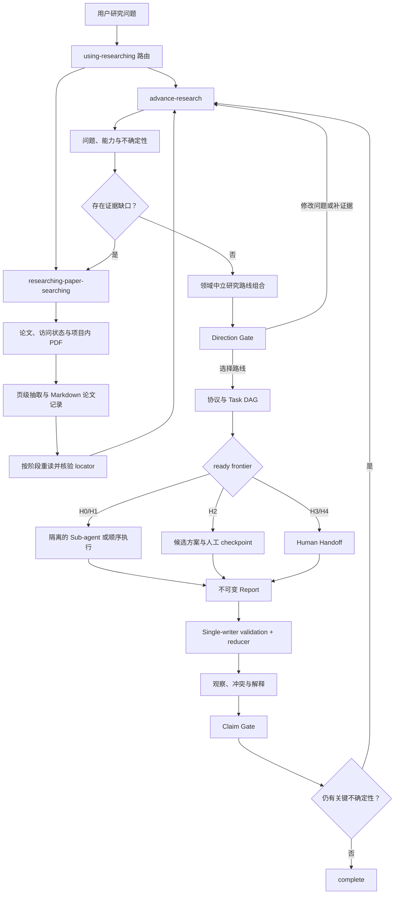

# Researching Plugin

Researching Plugin 是一个面向科研任务的 Codex 插件。它把“找论文”和“推进研究”
拆成两个可独立调用、又能互相回流的工作流：

- 文献发现与证据获取；
- 研究问题构建、证据综合、路线比较和人类半监督任务编排。

项目默认产出研究简报、证据记录、可行路线、Task DAG、Sub-agent Report 和
Human Handoff。具体方法由研究问题定义；插件不会因为本机能够执行某种工具，
就把它当成所有研究的默认实践路线。


## 设计目标

- 先建立可信的研究问题和证据边界，再讨论实现或实验。
- 将论文身份、公开元数据、开放获取、机构认证和下载权限分开处理。
- 将下载的 PDF 保存在科研目录，并生成可按阶段重复读取的 Markdown 论文记录。
- 用开放 `method_family` 表示具体方法，不在核心 Schema 中预设学科或路线枚举。
- 在范围、方向、方案、执行和最终主张上保留明确的人类决策权。
- 只并行分配安全、输入独立的低参与任务，并由主 Agent 单写者合并报告。
- 保留失败检索、访问限制、能力缺口、冲突证据和研究过程记录。

## 当前已实现的功能

### 1. 科研任务路由

入口 Skill 会根据任务所处阶段选择子 Skill，并在子流程结束后回到原研究任务：

| Skill | 负责内容 |
|---|---|
| `using-researching` | 插件入口；识别任务阶段并路由到合适的子 Skill |
| `researching-paper-searching` | 文献发现、访问解析、授权下载和项目内 Markdown 论文记录 |
| `advance-research` | 研究问题构建、证据综合、路线比较、Task DAG、H0-H4 与人类检查点 |

已加载插件后，可以直接调用：

```text
$using-researching
$researching-paper-searching
$advance-research
```

Plugin 的界面名称是 `Researching`。支持 Plugin 显示标签的界面会将 Skills
组织成：

```text
Researching: Research Router
Researching: Paper Searching
Researching: Advance Research
```

机器可调用的稳定标识仍使用合法的 kebab-case Plugin 命名空间：

```text
$researching-plugin:using-researching
$researching-plugin:researching-paper-searching
$researching-plugin:advance-research
```

`Researching: ...` 是用户界面标签，`researching-plugin:...` 是组件命名空间；
二者不要混写成不存在的 Skill 标识。

### 2. 匿名文献发现

插件内置的 Python runtime 已经实现：

- Crossref 无密钥元数据检索；
- 可选的 OpenAlex 元数据和学术图谱补充；
- DOI、保守标题和年份去重；
- 多来源记录合并；
- Unpaywall 合法开放获取位置解析；
- 单个 provider 失败时保留其他来源的部分成功结果；
- 对异常信息中的 API key、token、邮箱和授权头进行脱敏。

统一论文模型 `PaperRecord` 当前包含：

- 标题、作者、年份、期刊或会议；
- DOI、摘要、出版商页面；
- 开放获取地址；
- 引用数和参考文献数；
- 数据来源和访问状态。

访问状态不会简化成一个不可靠的布尔值：

| 状态 | 含义 |
|---|---|
| `metadata_only` | 已发现元数据，但尚未检查全文位置 |
| `open_access` | 已知存在合法开放全文位置 |
| `authentication_required` | 可能需要用户授权的机构会话，尚未确认具体订阅权限 |
| `unresolved` | 尚无可靠的开放位置或访问判断 |

### 3. alphaXiv 只读 MCP

插件捆绑一个名为 `alphaxiv-arxiv` 的本地 stdio MCP server。它只公开四个
只读工具：

| MCP 工具 | 用途 |
|---|---|
| `discover_papers` | 对研究问题进行语义化 arXiv 文献检索 |
| `get_paper_content` | 获取选中论文的报告或提取文本 |
| `answer_pdf_queries` | 根据论文页面回答一组问题 |
| `read_files_from_github_repository` | 阅读论文关联代码仓库中的文件 |

MCP 使用惰性连接：

1. 初始化和 `tools/list` 只运行本地 Node.js server；
2. 第一次真实 `tools/call` 才启动 `mcp-remote@0.1.38`；
3. 远程连接到 `https://api.alphaxiv.org/mcp/v1`；
4. 首次调用可能打开浏览器，由用户完成 alphaXiv OAuth；
5. 文件夹和文献库增删改工具不会暴露给 Codex。

alphaXiv 是 arXiv 之上的第三方检索与阅读服务，不替代 Crossref、OpenAlex、
Unpaywall，也不应被描述为官方 arXiv API。

> MCP 当前只封装 alphaXiv。Crossref、OpenAlex 和 Unpaywall 是本地 Python
> provider/resolver，不是 MCP 工具。

### 4. 项目内 PDF 与论文记忆

当用户为科研项目下载论文时，Plugin 将原始 PDF 与安装目录分离：

```text
<folder>/
├── pdf/<paper-id>.pdf
└── papers/
    ├── index.md
    ├── <paper-id>.md
    └── .extracted/<paper-id>.md
```

`scripts/prepare_paper.py` 使用 PyMuPDF 按 PDF 页码生成机器抽取 Markdown，创建
不会覆盖既有笔记的论文记录模板，并初始化轻量论文索引。机器抽取只用于导航；
公式、图表、表格、复杂版式和主张级内容仍需回到原 PDF 视觉核验。

科研推进不会在每轮加载全部论文，而按事件重复读取：恢复任务时先读索引，问题或
阶段变化时重新选择相关记录，形成文献性主张前重读命题和 locator，遇到冲突或
记录不足时回到原 PDF 页面。论文 Markdown 是长期阅读记忆，不会自动升级为
Evidence Packet。

### 5. 研究简报和路线构建

`advance-research` 默认执行基础研究循环：

1. 界定研究问题、贡献、范围、非目标和限制；
2. 判断任务的知识类型和领域约束；
3. 建立数据、工具、访问、专业知识、伦理和计算资源的能力地图；
4. 将证据缺口交给 `researching-paper-searching`；
5. 将检查过的来源转换成 Evidence Packet；
6. 建立概念与证据地图，保留冲突、尺度差异和未知项；
7. 生成二到四条方法上有实质区别的研究路线；
8. 比较信息增益、决策价值、资源要求、可行性和风险；
9. 形成研究简报，并在 Direction Gate 停止等待人类选择。

标准研究简报包含：

- 研究意图；
- 领域和能力地图；
- 按命题组织的证据地图；
- 概念综合和竞争性解释；
- 研究路线组合；
- 推荐意见和一个明确的人类决策请求。

### 6. Schema v2 研究状态与任务编排

Evidence Packet 将来源和科学主张分开记录，主要字段包括：

- 要支持或反驳的精确命题；
- `supports`、`contradicts`、`context` 或 `inconclusive` 立场；
- 文献、实验、观察或数据集来源；
- `metadata`、`abstract`、`full_text` 等访问深度；
- 页码、章节、图表等 locator；
- 局限和置信度。

元数据只能证明论文身份和研究背景，不能直接支持或反驳科学主张。全文证据必须
提供 locator。

对于跨会话项目，可以启用 durable research workspace：

```text
research_state.json
evidence.jsonl
decisions.jsonl
.checkpoints/
research_brief.md
research_process.md
research_summary.md
artifacts/
orchestration/
├── tasks/<task-id>/
└── reports/
```

其中 `research_state.json` 是规范状态；Evidence Packet 和决策日志保持
append-only；每次正式更新前保存 revision checkpoint。所有加载都经
`schema_version: "2.0"` 入口；未知版本拒绝写入，本版不自动迁移 v1。

顶层阶段是：

```text
framing → grounding → route_selection → planning → working
→ interpreting → claim_review → deciding → complete
```

路线由 `epistemic_goal`、开放的 `method_family`、`required_capabilities`、
`executor_mix`、`validation_strategy` 和 `uncertainty_ids` 正交描述。Task Node
记录依赖、输入快照、读写范围、资源锁、输出合同、验证与合并策略。

任务按行动性质分级：

| 等级 | 含义 | 自动编排行为 |
|---|---|---|
| H0 | 确定性、只读或可重复验证 | 可校验并合并 |
| H1 | 可批量处理、需要摘要或抽查 | 可并行，结果进入候选队列 |
| H2 | 路线、协议或解释选择点 | 只生成候选，等待 checkpoint |
| H3 | 依赖隐性知识和多轮人工反馈 | 生成 Human Handoff |
| H4 | 伦理、法律、物理操作、机构责任或最终主张 | 只能由人类执行或确认 |

主 Agent 根据 DAG 计算稳定的 ready frontier，默认最多并发 3 个会话内
Sub-agent。无 Sub-agent 能力时按同一 DAG 顺序执行，结果语义不变。Sub-agent
只读取冻结 Context Packet，不能继续派生 Agent、修改规范状态或批准 Gate；它
提交不可变 Report，由 Single-writer Reducer 检查 schema、revision/context
hash、locator、artifact hash、写入范围、同源重复和冲突后一次合并。

### 7. 人类监督 Gate

| Gate | 人类需要决定什么 | 不代表什么 |
|---|---|---|
| Scope Gate | 确认问题、范围、非目标和限制 | 不选择研究路线 |
| Evidence Gate | 持续检查证据深度、定位和冲突 | 不以元数据代替证据 |
| Direction Gate | 选择、组合、修改或拒绝研究路线 | 不批准执行 |
| Plan Gate | 审查具体协议、输入、指标、预算和停止条件 | 不批准运行 |
| Execution Gate | 明确授权命令、外部写入、数据移动、成本和副作用 | 不允许计划外扩张 |
| Claim Gate | 接受有边界的科学主张及其限制 | 不表示整个科研问题终结 |

“调研一下”“做一个 demo”“进行第一阶段”“继续”等表述默认只授权研究构建，
不构成实验执行授权。

### 8. 凭据和认证状态基础组件

本地认证模块已经实现以下基础能力：

- macOS Keychain；
- Windows Credential Manager；
- 对原生 keyring backend 的限制检查；
- AES-GCM 加密缓存；
- 原子写入和 `0600` 文件权限；
- 不把密码返回给模型的表单 autofill 接口；
- API key、Cookie、OAuth token 和 SAML 数据的日志隔离原则。

这些是安全基础组件，不代表已经完成任意学校或出版平台的无人值守登录。

## 工作循环



基础 Skill 的默认终点是 Direction Gate。人类选择路线后才生成协议和 Task
DAG；只有通过所需 Gate 的任务才会进入 frontier。循环可以暂停在人类任务上，
待返回 artifact 与偏差记录后恢复。

## 发布结构

```text
researching-plugin/
├── README.md
├── requirements.txt                 # PDF 处理与可选认证组件的 Python 依赖
├── .codex-plugin/plugin.json
├── .mcp.json
├── mcp/                             # alphaXiv 惰性只读 bridge
├── scripts/
│   ├── discover.py                  # 自举式匿名发现 CLI
│   └── prepare_paper.py             # 项目内 PDF 页级抽取与 Markdown 初始化
├── runtime/python/
│   └── researching_skill_runtime/
│       ├── domain/                  # PaperRecord、AccessStatus
│       ├── application/             # 发现编排、队列、manifest、登录提示
│       ├── providers/               # Crossref、OpenAlex
│       ├── resolvers/               # Unpaywall
│       ├── infrastructure/          # 可替换 HTTP 实现
│       ├── certification/           # 凭据存储、加密缓存、autofill
│       └── utils/
├── references/                      # 插件级架构说明
└── skills/
    ├── using-researching/
    ├── researching-paper-searching/
    └── advance-research/
        ├── references/              # brief、state、task、report、parallel、gate 合同
        └── scripts/
            ├── research_state.py    # Schema v2、DAG、状态转换和 checkpoint
            ├── task_orchestration.py # context、frontier、report validation、reducer
            └── manage_tasks.py      # 统一任务 CLI
```

`researching-plugin/` 是完整、唯一的发布单元。通过 Git subtree 或独立仓库分发
该目录时，README、MCP、Skills、Python runtime 和依赖声明会一起发布，不依赖
开发仓库中位于该目录之外的 Python 模块。开发测试可以保留在外层仓库，不进入
Plugin release。

## 使用方式

### 在 Codex 中

插件加载后，可以从入口开始：

```text
使用 $using-researching，把“现有证据能否区分两个竞争性解释”构造成研究简报、
可行路线和需要我参与的检查点。
```

直接检索证据：

```text
使用 $researching-paper-searching，查找 tokenization parallel 与 regex
pre-compilation 性能影响的论文，并说明每篇论文能支持哪个命题。
```

下载并建立项目内论文记录：

```text
使用 $researching-paper-searching，将选中的开放获取论文下载到当前科研目录的
pdf/，完成页级拆解并生成 papers/ 下的 Markdown 记录。
```

直接构建研究方向：

```text
使用 $advance-research，为这个问题生成领域中立的路线组合和 Task DAG；只并行
安全的低参与任务，并在需要我选择方向或提供材料时停止。
```

### 运行本地匿名发现

从 Plugin 根目录运行 Crossref 基线：

```bash
python scripts/discover.py \
  "tokenization parallel regex pre-compilation" \
  --limit 10
```

同时解析 Unpaywall 合法开放全文位置：

```bash
python scripts/discover.py \
  "tokenization parallel regex pre-compilation" \
  --limit 10 \
  --email researcher@example.edu \
  --resolve-oa
```

命令输出 JSON，包含查询、访问状态 manifest、规范化论文、登录提示和 provider
失败记录。

### 初始化 durable research workspace

```bash
python skills/advance-research/scripts/init_research.py \
  ./research-workspace \
  --question "一个有边界的研究问题" \
  --scope "纳入的范围" \
  --non-goal "明确排除的目标" \
  --constraint "数据或资源限制"
```

验证和生成摘要：

```bash
python skills/advance-research/scripts/validate_state.py \
  ./research-workspace

python skills/advance-research/scripts/render_summary.py \
  ./research-workspace
```

规范状态不能手工覆盖。先生成候选状态，再通过 `update_state.py` 提交：

```bash
python skills/advance-research/scripts/update_state.py \
  ./research-workspace \
  --candidate ./candidate-state.json \
  --action "记录本次研究决策" \
  --rationale "该决策与证据和限制的关系"
```

规范状态只有主 Agent 能通过 updater/reducer 写入。Sub-agent 使用统一任务 CLI：

```bash
# 生成并冻结一个任务的最小 Context Packet
python skills/advance-research/scripts/manage_tasks.py \
  context ./research-workspace T-001 --prepare

# 计算最多三个互不冲突的 ready tasks，并将选中批次标为 running
python skills/advance-research/scripts/manage_tasks.py \
  frontier ./research-workspace --max-parallel 3
python skills/advance-research/scripts/manage_tasks.py \
  start ./research-workspace --max-parallel 3

# 主 Agent 验证并合并不可变报告
python skills/advance-research/scripts/manage_tasks.py \
  validate-report ./research-workspace ./report.json
python skills/advance-research/scripts/manage_tasks.py \
  merge-report ./research-workspace ./report.json

# 为 H3/H4 渲染人工任务包
python skills/advance-research/scripts/manage_tasks.py \
  handoff ./research-workspace T-014 --output ./handoff.md
```

`frontier` 只调度依赖已满足、输入已冻结、无资源锁冲突、无未满足 Gate，且没有
高风险副作用的节点。Report 中的 observation、evidence 和 claim 都只是候选；
Reducer 会分配规范 ID，Claim 仍保持 `candidate`，不能代替 Claim Gate。

## 依赖

匿名 Crossref 检索只要求 Python 3.11 或更高版本。以下功能需要可选依赖：

- 原生凭据存储：`keyring>=24`；
- 加密认证状态缓存：`cryptography>=42`。

在明确需要这些功能时，从 Plugin 根目录安装：

```bash
python -m pip install -r requirements.txt
```

Codex Plugin 安装不会因为目录中存在 `requirements.txt` 就自动修改 Python
环境；应先说明用途并取得用户同意。

alphaXiv MCP 额外要求：

- Node.js；
- `npm` / `npx`；
- 首次真实调用时可用的浏览器 OAuth 回调；
- 能访问 alphaXiv MCP endpoint 的网络。

插件通过固定版本的 `mcp-remote@0.1.38` 惰性连接，不需要把 alphaXiv 注册成
全局 `npx mcp-remote` server。

## 验证

运行 Python 测试：

```bash
python -m unittest discover -s tests -v
```

从 Plugin 根目录运行 MCP bridge 测试：

```bash
node --test mcp/server.test.mjs
```

验证三个可分发 Skill：

```bash
python /path/to/skill-creator/scripts/quick_validate.py \
  skills/using-researching

python /path/to/skill-creator/scripts/quick_validate.py \
  skills/researching-paper-searching

python /path/to/skill-creator/scripts/quick_validate.py \
  skills/advance-research
```

`/path/to/skill-creator` 需要替换为当前 Codex 环境中的 `skill-creator` Skill
目录。

最后验证完整 Plugin manifest：

```bash
python /path/to/plugin-creator/scripts/validate_plugin.py .
git diff --check
```

## 当前边界

当前版本没有宣称实现：

- 自动替研究者选择科研方向；
- 未经确认直接执行受限、不可逆或外部写入动作；
- 使用本地 toy/synthetic 数据代替缺失的真实领域条件；
- 自动访问物理环境、受治理数据、受限来源或专有系统；
- 仅凭论文元数据生成科学结论；
- 让 Sub-agent 修改规范 Claim、批准 Gate 或派生更多 Agent；
- 引入常驻 scheduler、新 MCP worker 或绕过 sandbox；
- 绕过 MFA、CAPTCHA、订阅权限、robots policy 或下载限制；
- 将 alphaXiv OAuth 视为学校、CARSI、CNKI 或出版商登录；
- 端到端覆盖所有学科的研究执行环境。

遇到本机不具备的数据、软件、仪器、地点、专业知识、许可或伦理审批时，Skill
应将其记录为 capability gap，并提出获取、合作、远程执行或验证方案，再交给
研究者决策。

## 进一步阅读

- [匿名文献发现架构](references/discovery.md)
- [alphaXiv MCP 架构](references/alphaxiv-mcp.md)
- [研究简报合同](skills/advance-research/references/research-brief-contract.md)
- [研究状态合同](skills/advance-research/references/state-contract.md)
- [Task Node 与 H0-H4 合同](skills/advance-research/references/task-node-contract.md)
- [Sub-agent Report 合同](skills/advance-research/references/subagent-report-contract.md)
- [并行、资源锁与合并策略](skills/advance-research/references/parallelization-policy.md)
- [Prompt operators](skills/advance-research/references/prompt-kinds.md)
- [Research gates](skills/advance-research/references/gates.md)
- [Human checkpoints](skills/advance-research/references/human-checkpoints.md)
